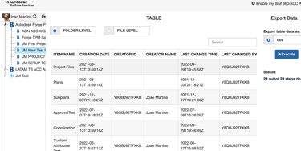

# Files and folders extraction sample


[](http://opensource.org/licenses/MIT)

[](http://developer.autodesk.com/)
[](http://developer.autodesk.com/)
[](http://developer.autodesk.com/)
[](http://developer.autodesk.com/)


# Description

This sample demonstrate how to retrieve data of all the folders and files on a specific project to render on a table and export it as csv. This sample recursively iterate through all folders of the selected project. It works by traversing the entire folder structure and sending the individual contents to the client one by one. Every file and folder under the selected project are rendered on the user table and can be exported as csv.

## Thumbnail



## Live version

Try it at https://aps-hubs-recursive-extraction.autodesk.io/


## DEMO VIDEO

[](https://www.youtube.com/watch?v=VDFbMNllJPU)

# Setup

## Prerequisites

1. **APS Account**: Learn how to create a APS Account, activate subscription and create an app at [this tutorial](http://aps.autodesk.com/tutorials/#/account/).
2. **Visual Studio**: Either Community (Windows) or Code (Windows, MacOS).
3. **.NET Core** basic knowledge with C#
4. **HangFire**: Library for dealing with queueing. [learn more] (https://www.hangfire.io).

## Running locally

Clone this project or download it. It's recommended to install [GitHub desktop](https://desktop.github.com/). To clone it via command line, use the following (**Terminal** on MacOSX/Linux, **Git Shell** on Windows):

    git clone https://github.com/autodesk-platform-services/aps-hubs-recursive-extraction

**Visual Studio** (Windows):

Right-click on the project, then go to **Debug**. Adjust the settings as shown below. For environment variable, define the following:

- ASPNETCORE_ENVIRONMENT: `Development`
- APS_CLIENT_ID: `your id here`
- APS_CLIENT_SECRET: `your secret here`
- APS_CALLBACK_URL: `http://localhost:8080/api/aps/callback/oauth`

**Visual Sutdio Code** (Windows, MacOS):

Open the folder, at the bottom-right, select **Yes** and **Restore**. This restores the packages (e.g. Autodesk.Forge) and creates the launch.json file. See _Tips & Tricks_ for .NET Core on MacOS.

At the `.vscode\launch.json`, find the env vars and add your APS Client ID, Secret and callback URL. Also define the `ASPNETCORE_URLS` variable. The end result should be as shown below:

```json
"env": {
  "ASPNETCORE_ENVIRONMENT": "Development",
  "ASPNETCORE_URLS" : "http://localhost:8080",
  "APS_CALLBACK_URL": "http://localhost:8080/api/aps/callback/oauth",
  "APS_CLIENT_SECRET": "your client secret here",
  "APS_CLIENT_ID": "your client Id here"
},
```

Open `http://localhost:3000` to start the app. Select **Index my BIM 360 Account** before using (this process may take a while). Check the `http://localhost:3000/dashboard` to see the jobs running (Hangfire dashboard).

# Further Reading

Documentation:

- [BIM 360 API](https://developer.autodesk.com/en/docs/bim360/v1/overview/)
- [Data Management API](https://developer.autodesk.com/en/docs/data/v2/overview/)

Other APIs:

- [Hangfire](https://www.hangfire.io/) queueing library for .NET

### Tips & Tricks

This sample uses .NET Core and works fine on both Windows and MacOS, see [this tutorial for MacOS](https://github.com/augustogoncalves/dotnetcoreheroku).

### Troubleshooting

1. **Cannot see my BIM 360/ACC projects**: Make sure to provision the APS App Client ID within the BIM 360 Account, [learn more here](https://aps.autodesk.com/blog/bim-360-docs-provisioning-forge-apps). This requires the Account Admin permission.

2. **error setting certificate verify locations** error: may happen on Windows, use the following: `git config --global http.sslverify "false"`

## License

This sample is licensed under the terms of the [MIT License](http://opensource.org/licenses/MIT). Please see the [LICENSE](LICENSE) file for full details.

## Written by

João Martins [in/jpornelas](https://www.linkedin.com/in/jpornelas), [APS Partner Development](http://aps.autodesk.com)
